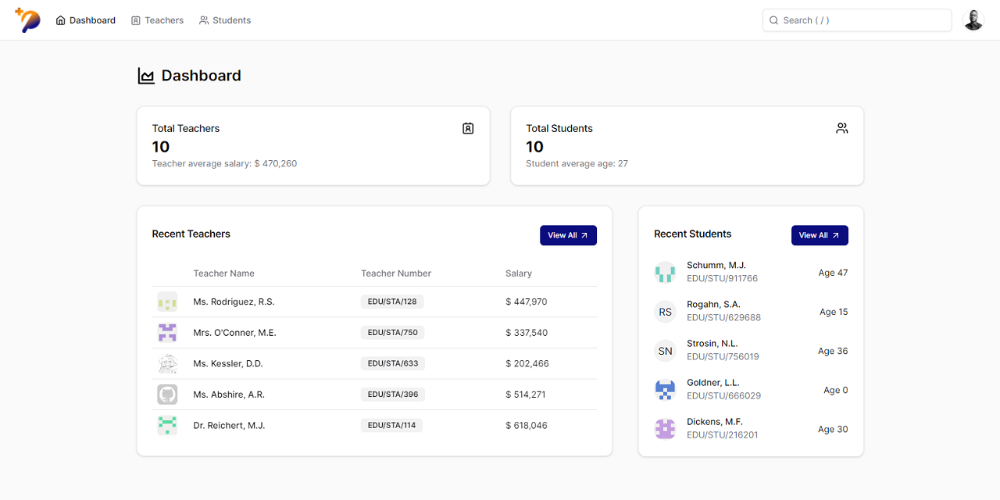

# PlateauEdu

PlateauMed - Senior Frontend Engineer Assessment

[](https://react.dev/learn/installation)
[](https://nextjs.org/docs/getting-started/installation)
[](https://www.typescriptlang.org/docs/)
[](https://tailwindcss.com/docs/installation)
[](https://www.radix-ui.com/primitives/docs/overview/getting-started)


## Setup

```bash
$ git clone https://github.com/2gbeh/plateau-edu.git

$ cd plateau-edu

$ npm cache clean --force

$ npm install

$ npm run dev
```

## Usage

> Local: http://localhost:3000/

> Live: https://plateau-edu.vercel.app/

## Screenshot



## Resources

* [Interview Question](./public/todo.pdf)
